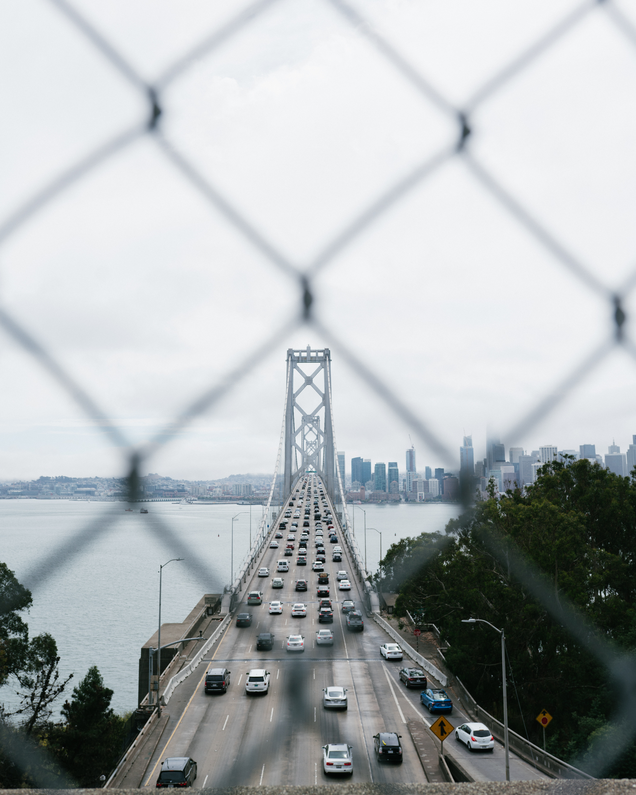
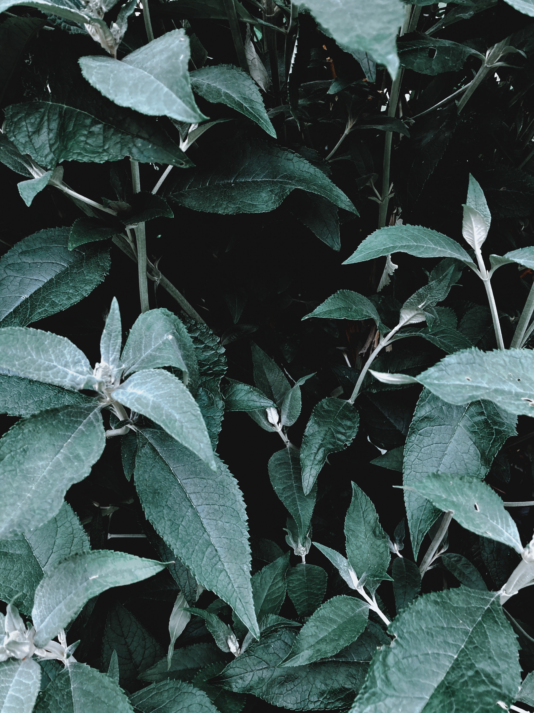

## 📁7_gallery

**Grid를 사용한 갤러리 만들기**

[유튜브링크](https://www.youtube.com/watch?v=sHG3Sf6XN9g)


## 공부

### Grid

**그리드란?**

- 2차원(행과 열)의 레이아웃 시스템을 제공하는 CSS 기능입니다.
  flex box 보다 좀 더 고차원 적인 레이아웃을 위해 생겨났습니다.

**grid-template-columns: repeat(auto-fit, minmax(250px, 1fr));**

- 해당 그리드의 컬럼을 명시해줍니다.

  repeat 안의 값을 반복해서 컬럼을 생성합니다.

- `minmax(최소값, 최대값)`

  컬럼 안의 요소가 가지는 최소값과 최대값을 설정합니다. 위 코드에서 최대값으로 1fr을 주는 이유는 부모 컨테이너가 `width:80%`를 가지기 때문에 크기가 변동 될 경우, 남는 여백없이 전체 공간을 사용하기 위해서 입니다. 1fr을 쓰지않는 경우 여백이 남게됩니다.

- `auto-fit`과 `auto-fill`

  auto-fit과 auto-fill은 repeat로 반복할 행열 개수가 명확할 필요가 없거나 명확하지 않은 경우 사용

  내부 요소가 부모 컨테이너의 크기를 초과할 경우 자동으로 줄을 변경합니다.
  auto-fit은 남는 공간을 축소하고 auto-fill은 남은 공간을 그대로 유지시킵니다.

### 닫는 태그가 없는 경우 가상 요소 사용불가

`img`같이 닫는 태그가 없는 경우 `before`와 `after` 같은 가상 요소를 사용할 수 없다

```css
.img-gallery img:hover {
  /* img태그들에는 befor나 after같은 가상 요소 사용 불가 */
  /* transform: scale(0.8) rotate(-15deg); */
  border-radius: 20px;
  filter: grayscale(1);
}
```

### 이벤트 위임

이벤트 리스너를 하위 요소들에 추가하는 것이 아니라 상위 요소에 추가하는 것을 말한다.

- 각 하위 항목 하나하나에 이벤트 리스너를 연결하지 않고 상위 요소 하나에 이벤트 리스너를 연결하면 되기 때문에 메모리 사용 공간을 줄일 수 있다.

아래 코드는 img태그를 클릭하면 이벤트가 발생해야한다.

```html
<section class="img-gallery" id="imgGallery">
  <!-- 모든 요소에 이벤트를 걸어주는 건 불편 -->
  
  
  
  
  
  
  
  
</section>
```

이벤트 리스너를 하위 img태그에 모두 설정하는 것이 아니라

부모인 `imgGallery`에 설정한 후,

- `e.target`의 `nodeName`으로 이벤트가 일어날 요소를 결정한다

```js
const openFullImg = (e) => {
  if (e.target.nodeName !== 'IMG') return;
  fullImgBox.classList.add('active');
  // 이벤트가 전달한 객체
  console.log(e.target);
  // 이벤트 핸들러를 호출하는 객체
  console.log(e.currentTarget);
  fullImg.src = e.target.src;
};

// 이벤트 처리
imgGallery.addEventListener('click', openFullImg);
```

- `e.target`

  이벤트가 전달한 객체 = 클릭 된 img 태그

- `e.currentTarget`

  이벤트 핸들러를 호출한 객체 = imgGallery
